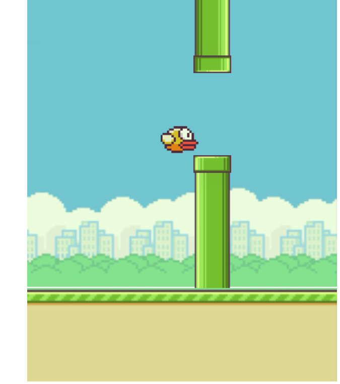

# flappy-bird

This is my version of the Flappy Bird game. This game was really fun to make. I was inspired by Ania Kubow to make this game.

# Environment Setup
1. Clone my repo at https://github.com/davidmstanleyjr/flappy-bird/

2. CD into it and click "run in default browser" from the index.html file.

# Technologies Used
1. HTML
2. CSS
3. Javascript

# Issues

Figuring out how to get the timer to work so that the pipes appeared in certain intervals was tough. Also getting the screen to move from left to right was tough. The doodle jump game I did previously helped me out with this one.

# Screenshots

# Live Page

Here is a link to the deployed site
https://davidmstanleyjr.github.io/flappy-bird/